# Student Placement Prediction & Salary Prediction

A two-stage supervised machine-learning system that estimates a student's **model-estimated placement probability**, **salary if placed**, **10th-to-90th-percentile salary interval**, and derived **expected LPA**. The repository contains the 100,000-record dataset, an end-to-end training and evaluation notebook, trained model artifacts and reports, a Flask inference API, and a schema-driven React + Vite application.

Predictions are estimates based on this dataset. They do not guarantee placement or salary and are not suitable for real hiring, admissions, or other consequential decisions.

**Project links:** [GitHub repository](https://github.com/kishlay-bit/PlacementPredictor) · [Kaggle dataset](https://www.kaggle.com/datasets/kishlaytejeswi/student-placement-prediction-dataset)

[](https://www.python.org/)
[](https://scikit-learn.org/)
[](https://xgboost.readthedocs.io/)
[](https://lightgbm.readthedocs.io/)
[](https://pandas.pydata.org/)
[](https://numpy.org/)
[](https://jupyter.org/)

## Table of Contents

- [Student Placement Prediction \& Salary Prediction](#student-placement-prediction--salary-prediction)
  - [Table of Contents](#table-of-contents)
  - [1. Overview](#1-overview)
  - [2. Problem Statement](#2-problem-statement)
  - [3. Key Objectives](#3-key-objectives)
  - [4. System Architecture](#4-system-architecture)
  - [5. Dataset](#5-dataset)
    - [Targets](#targets)
  - [6. Data Dictionary](#6-data-dictionary)
  - [7. Exploratory Data Analysis](#7-exploratory-data-analysis)
  - [8. Data Quality and Preprocessing](#8-data-quality-and-preprocessing)
    - [Audit findings](#audit-findings)
    - [Feature engineering and preprocessing sequence](#feature-engineering-and-preprocessing-sequence)
  - [9. Leakage Prevention](#9-leakage-prevention)
  - [10. Feature Selection](#10-feature-selection)
  - [11. Feature Engineering](#11-feature-engineering)
  - [12. Model Development](#12-model-development)
    - [Models compared](#models-compared)
    - [Tuning and training settings](#tuning-and-training-settings)
  - [13. Placement Classification](#13-placement-classification)
    - [Target and validation design](#target-and-validation-design)
    - [Test-set comparison](#test-set-comparison)
    - [Metric interpretation](#metric-interpretation)
  - [14. Salary Regression](#14-salary-regression)
    - [Test-set comparison](#test-set-comparison-1)
  - [15. Model Selection](#15-model-selection)
    - [One-standard-error rule](#one-standard-error-rule)
    - [Main cross-validation results](#main-cross-validation-results)
  - [16. Probability Calibration](#16-probability-calibration)
  - [17. Salary Uncertainty](#17-salary-uncertainty)
  - [18. End-to-End Expected LPA](#18-end-to-end-expected-lpa)
  - [19. Explainability](#19-explainability)
    - [Permutation importance](#permutation-importance)
    - [SHAP](#shap)
  - [20. What-If Analysis](#20-what-if-analysis)
  - [21. Results](#21-results)
  - [22. Important Visualizations](#22-important-visualizations)
    - [Data and feature exploration](#data-and-feature-exploration)
    - [Placement model evaluation](#placement-model-evaluation)
    - [Salary, importance, and scenarios](#salary-importance-and-scenarios)
  - [23. Saved Model Artifacts](#23-saved-model-artifacts)
    - [`ML/03_models/`](#ml03_models)
    - [`ML/04_reports/`](#ml04_reports)
    - [`ML/05_app_ready/`](#ml05_app_ready)
  - [24. Inference Pipeline](#24-inference-pipeline)
  - [25. Frontend and Backend Integration](#25-frontend-and-backend-integration)
    - [Backend](#backend)
    - [Frontend](#frontend)
  - [26. Reproducibility](#26-reproducibility)
    - [Run the application locally](#run-the-application-locally)
    - [Run the notebook](#run-the-notebook)
    - [Direct predictor smoke test](#direct-predictor-smoke-test)
  - [27. Limitations](#27-limitations)
  - [28. Future Work](#28-future-work)
  - [29. Project Structure](#29-project-structure)
  - [30. Conclusion](#30-conclusion)
  - [31. References](#31-references)

## 1. Overview

This repository implements an end-to-end tabular ML workflow rather than a single salary regression. The notebook audits the source data, splits it, explores training data, selects and engineers features, compares classifiers and regressors, evaluates probability calibration and salary uncertainty, and exports the model objects and schema used by the application.

The current generated artifacts report 100,000 source rows, 27 eligible model inputs, a Logistic Regression placement classifier with isotonic calibration, and an XGBoost salary regressor. Two LightGBM quantile models estimate the salary interval. The active schema and `model_card.json` are the runtime metadata sources; the notebook at [`ML/02_notebook/ai-project04.ipynb`](ML/02_notebook/ai-project04.ipynb) documents how those artifacts were produced.

## 2. Problem Statement

The application estimates two different outcomes from an academic, technical, experience, and career-preparation profile:

1. Whether a student is placed, represented as a model-estimated probability.
2. The student's salary in LPA conditional on being placed, with a lower and upper estimate.

These are not interchangeable targets. The classifier is trained using all records and the binary `placement_status` target. The salary regressor is trained only using placed records with observed `expected_lpa` values. Unplaced rows do not have a salary target in the source CSV.

The application also computes the expected-LPA quantity:

$$
\operatorname{Expected\ LPA} = P(\text{Placed}) \times \widehat{\operatorname{Salary}}_{\text{if placed}}
$$

It is a probability-weighted estimate across the two outcomes, not a salary offer or a guaranteed outcome. The frontend displays the salary-if-placed estimate and range as separate values and also shows expected LPA as a secondary result.

## 3. Key Objectives

- Build separate, task-appropriate placement classification and conditional salary regression models.
- Prevent target leakage and keep test data out of feature selection, preprocessing fitting, and model selection.
- Compare linear, tree-based, boosted, and stacked models using consistent training folds.
- Select a model using cross-validation rather than choosing from the test-set leaderboard.
- Calibrate the placement probability only when the training out-of-fold Brier score improves by the notebook's specified margin.
- Report a salary interval and measure its empirical coverage on held-out placed students.
- Preserve a machine-readable schema so the form fields, labels, ranges, and categories match the deployed models.
- Communicate uncertainty and dataset limitations instead of presenting model outputs as facts.

## 4. System Architecture

The notebook's training and the running application's inference paths are related but distinct. The model pipeline used for inference is:

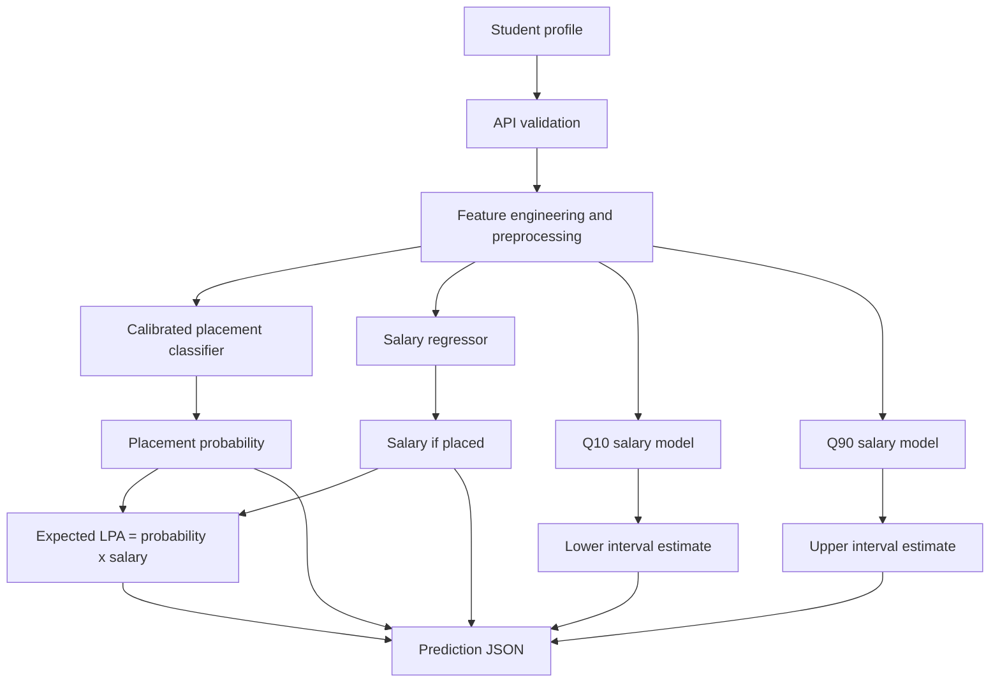

The deployment flow is frontend form → Flask endpoint → `PlacementPredictor` → serialized model pipelines → prediction JSON → result dashboard. Training uses a separate stratified train/test split, cross-validation on training data, and a locked test set for final assessment.

## 5. Dataset

- **Dataset:** [Student Placement Prediction Dataset](https://www.kaggle.com/datasets/kishlaytejeswi/student-placement-prediction-dataset)
- **Local file:** `ML/01_data/placement_dataset_100k.csv`
- **Observed shape in the notebook:** 100,000 rows × 31 columns
- **Duplicate rows:** 0
- **Identifier uniqueness:** `student_id` is unique
- **Placement status counts:** 63,930 placed (`1`) and 36,070 not placed (`0`); placement rate 0.6393.
- **Observed salary for placed rows:** mean 12.83 LPA, median 10.65 LPA, standard deviation 6.61 LPA, and observed range 5.29–49.98 LPA.

The fields cover academic performance, internships, projects, technical skills, coding and interview scores, career preparation, profile preferences, and the two outcomes. These are the counts and summaries printed by the current notebook's data audit; they describe this dataset, not the wider student population.

### Targets

- **Classification target:** `placement_status`, a binary value (`0` or `1`). The notebook aliases it to `placed` internally.
- **Salary target:** `expected_lpa`, a numeric salary in lakhs per annum, used only for placed records with observed salary values.
- **Missing salary values:** all 36,070 missing `expected_lpa` values correspond to not-placed records in this CSV. The raw source data is not changed to encode these as zero. A zero realized salary is substituted only during the separate end-to-end evaluation of all test students.

## 6. Data Dictionary

The following is the current CSV schema. “Input” means used by both final model stages in this run. `feature_schema.json` gives the serving-time label, numeric bounds or categorical values, and defaults for the 27 inputs.

| Feature | Type | Meaning | Role in this run |
|---|---|---|---|
| `student_id` | String | Student record identifier | Excluded identifier |
| `age` | Integer | Student age | Excluded protected attribute |
| `cgpa` | Float | Grade point average on a 10-point scale | Input |
| `backlogs` | Integer | Active backlog count | Input |
| `attendance_percentage` | Float | Attendance percentage | Input |
| `internship_count` | Integer | Number of completed internships | Input |
| `internship_months` | Integer | Total internship duration in months | Input |
| `projects_count` | Integer | Number of completed projects | Input |
| `technical_skills_count` | Integer | Count of technical skills | Input |
| `coding_skill_score` | Float | Coding skill score | Input |
| `communication_score` | Float | Communication score | Input |
| `aptitude_score` | Float | Aptitude score | Input |
| `dsa_score` | Float | Data structures and algorithms score | Input |
| `core_subject_score` | Float | Core-subject score | Input |
| `certifications_count` | Integer | Certification count | Input |
| `hackathon_count` | Integer | Hackathon participation count | Input |
| `extracurricular_score` | Float | Extracurricular score | Input |
| `github_projects` | Integer | Number of GitHub projects | Input |
| `coding_contest_rating` | Integer | Coding contest rating | Input |
| `work_experience_months` | Integer | Work experience in months | Input |
| `resume_score` | Float | Resume score | Input |
| `interview_score` | Float | Interview score | Input |
| `academic_consistency` | Float | Academic consistency score | Input |
| `placement_preparation_hours_per_week` | Float | Weekly placement-preparation hours | Input |
| `college_tier` | Categorical | College tier | Input |
| `degree_type` | Categorical | Degree type | Input |
| `specialization` | Categorical | Academic specialization | Input |
| `preferred_job_role` | Categorical | Preferred job role | Input |
| `location_preference` | Categorical | Preferred work location | Input |
| `placement_status` | Integer (0/1) | Observed placement outcome | Classification target; excluded from inputs |
| `expected_lpa` | Float / missing | Salary in LPA for placed students | Salary target; excluded from inputs |

There is no `gender` column in the current dataset. There are 27 model input features (22 numeric and 5 categorical), and all 27 passed the current feature-selection threshold for both tasks. The serving schema's exact category options and numeric limits take precedence over informal descriptions in this table.

## 7. Exploratory Data Analysis

The notebook performs the EDA after the stratified split and uses the training partition for target distributions, numeric correlations, and feature comparisons. Generated charts are stored in [`ML/04_reports/figures/`](ML/04_reports/figures/).

The target plot shows that the training set has more placed than unplaced records, while salaries among placed students have a right-skewed distribution with a long upper tail. The training correlation heatmap is descriptive: it does not establish causality, and the final modeling process also checks statistical association and cross-validation results.

## 8. Data Quality and Preprocessing

### Audit findings

The notebook checks data types, missingness, duplicate rows, identifier uniqueness, target consistency, and numeric ranges. The current audit reports:

| Column | Missing values |
|---|---:|
| `attendance_percentage` | 1,952 |
| `aptitude_score` | 1,007 |
| `github_projects` | 1,485 |
| `resume_score` | 1,927 |
| `interview_score` | 2,983 |
| `location_preference` | 1,050 |
| `expected_lpa` | 36,070 |

The six missing input columns are handled within the sklearn preprocessing pipelines. Numeric inputs use median imputation followed by standard scaling. Categorical inputs use most-frequent imputation followed by one-hot encoding with `handle_unknown="ignore"`. These transformations are fitted as part of each training fold or training fit; they are not pre-fitted on the complete dataset.

`expected_lpa` is not imputed as a regression target for unplaced students. Salary training and evaluation are restricted to placed students with observed salary. During inference, the API requires every schema field and validates it before the predictor runs.

### Feature engineering and preprocessing sequence

The saved estimator is an sklearn `Pipeline` containing the custom `FeatureEngineer`, a `ColumnTransformer`, and the estimator. The numeric and categorical branches are selected by dtype, so imputation, scaling, and one-hot encoding remain part of the fitted model object and are consistently reused at inference.

## 9. Leakage Prevention

The notebook's sequence and exclusions are designed to prevent information from the answers or locked test set entering training:

1. It makes an 80/20 stratified train/test split before feature statistics or model fitting. With the current full run this is 80,000 training rows and 20,000 test rows.
2. It uses `student_id` only as an identifier and excludes it from candidate inputs.
3. It excludes `age` as a protected attribute. Gender is not present in the dataset.
4. It excludes `placement_status`, its internal alias `placed`, and `expected_lpa` from candidate features.
5. It calculates feature-selection tests and mutual information using training records only. The salary tests use placed training records only.
6. It fits imputers, scalers, encoders, feature engineering and estimators inside sklearn pipelines during cross-validation and training.
7. It performs hyperparameter search and calibration using training data only.
8. It evaluates the selected candidate and all comparison candidates on the locked test set only after training decisions are made. That test set is not used to fit the preprocessing or choose the deployed estimator.

The end-to-end test calculation uses `expected_lpa.fillna(0)` to represent realized salary for unplaced students for that evaluation only. It does not rewrite the source CSV or feed this derived value into the classifier.

## 10. Feature Selection

Feature selection is conducted separately for placement and salary on the training partition, at significance threshold `ALPHA = 0.001`.

- Numeric feature vs. placement: ANOVA F-test (`f_classif`).
- Categorical feature vs. placement: chi-square contingency test.
- Numeric feature vs. salary among placed training rows: univariate F-test (`f_regression`).
- Categorical feature vs. salary: one-way ANOVA across categories.
- Mutual information is calculated as an additional non-linear association summary; it does not replace the p-value keep/drop rule.
- Effect sizes are reported separately from p-values: absolute correlation for numeric fields, Cramér's V for categorical placement relationships, and eta correlation for categorical salary relationships.

In the current generated [`feature_selection_table.csv`](ML/04_reports/feature_selection_table.csv), all 27 candidates are retained for placement and all 27 are retained for salary (`p < 0.001`). Therefore the feature-selection procedure ran, but it did not reduce the current candidate set. The explicit excluded fields are identifier, protected attribute, and outcomes; they are excluded before statistical selection.

The strongest report-only effect sizes include:

| Task | Feature | Reported effect size | Notebook interpretation |
|---|---|---:|---|
| Placement | `cgpa` | 0.3933 | Strong |
| Placement | `dsa_score` | 0.3489 | Strong |
| Placement | `coding_skill_score` | 0.3296 | Strong |
| Placement | `interview_score` | 0.3179 | Strong |
| Placement | `academic_consistency` | 0.3064 | Strong |
| Salary | `coding_skill_score` | 0.6071 | Strong |
| Salary | `dsa_score` | 0.5734 | Strong |
| Salary | `interview_score` | 0.4688 | Strong |
| Salary | `projects_count` | 0.3936 | Strong |
| Salary | `internship_count` | 0.3894 | Strong |

These are univariate association effect sizes from the feature-selection report, not permutation importance, coefficients, causal effects, or a ranking of deployed predictions. Statistical significance in a large dataset should not be confused with practical magnitude.

## 11. Feature Engineering

The notebook tests three stateless features in the pipeline:

| Engineered feature | Current computation | Interpretation |
|---|---|---|
| `skill_index` | Mean of the available values among `coding_skill_score`, `aptitude_score`, `communication_score`, `dsa_score`, and `core_subject_score` | Composite summary of assessed skill scores |
| `experience_index` | `internship_count + projects_count` | Simple combined count of internships and projects |
| `has_backlog` | `1` when `backlogs > 0`, otherwise `0` | Binary backlog indicator |

The feature-engineering ablation compares all candidates, selected candidates, and selected candidates plus engineered features using a five-fold training-only check. The engineered set was retained because its measured CV means were slightly higher:

| Task and metric | Selected only | Selected + engineered | Difference |
|---|---:|---:|---:|
| Placement ROC-AUC | 0.8072425 | 0.8073069 | +0.0000644 |
| Salary R² | 0.5643202 | 0.5644101 | +0.0000899 |

These differences are small; the ablation does not establish that engineering materially improves generalization. The separate `internship_intensity`, `projects_per_skill`, `academic_performance_index`, `technical_strength_index`, `overall_profile_index`, and `preparation_skill_index` names are not part of the current saved feature engineer and are not claimed as implemented here.

## 12. Model Development

This is supervised machine learning, not deep learning. The models learn statistical relationships between profile inputs and observed training targets by minimizing their algorithm-specific losses/objectives. Cross-validation estimates how those fitted pipelines behave on training records not used to fit a particular fold. The locked test set is reserved for final reporting.

### Models compared

| Task | Candidate | Model family and purpose |
|---|---|---|
| Placement | Logistic Regression | Regularized linear classifier and interpretable probability baseline |
| Placement | Random Forest | Bagged decision trees for non-linear splits and feature interactions |
| Placement | XGBoost | Gradient-boosted decision trees for tabular classification |
| Placement | Stacking Ensemble | Logistic Regression, Random Forest, XGBoost, and LightGBM base learners; Logistic Regression meta-learner combines out-of-fold predictions |
| Salary | Ridge Regression | Regularized linear regression baseline |
| Salary | Random Forest Regressor | Bagged trees for non-linear salary patterns |
| Salary | XGBoost Regressor | Gradient-boosted trees for salary regression |
| Salary | Stacking Regressor | Ridge, Random Forest, XGBoost, and LightGBM base learners; Ridge meta-learner combines predictions |

LightGBM is included in the stacking candidates and is also the estimator family used for the two quantile models. The four candidate pipelines per task are compared with the same task-specific folds and training data.

### Tuning and training settings

The full notebook run uses `RANDOM_STATE = 42`, an 80/20 stratified holdout split, five CV folds for main model comparisons, and a 30,000-row training sample for hyperparameter search. Search itself uses three folds and ten randomized-search iterations where randomized search is used; linear-model candidates use grid search. The code tunes Logistic Regression/Ridge and Random Forest/XGBoost. Stacking learners combine the tuned estimators with fixed regularized LightGBM base learners and a linear meta-estimator.

The saved model-library versions are scikit-learn 1.6.1, XGBoost 3.4.1, LightGBM 4.6.0, pandas 2.3.3, and NumPy 2.1.3. See `ML/05_app_ready/requirements.txt` for the serving pins. Serialized sklearn and XGBoost objects are version-sensitive.

## 13. Placement Classification

### Target and validation design

The classifier input is the 27-feature student profile and the target is `placement_status` (internally aliased to `placed`). Classification model comparison uses five-fold `StratifiedKFold` with shuffling and the fixed random seed, preserving the target proportion across folds. The final comparison also includes an always-predict-prior dummy reference.

### Test-set comparison

The values below come from [`classification_test_results.csv`](ML/04_reports/classification_test_results.csv), generated by fitting each raw candidate pipeline on the 80,000-row training partition and evaluating it on the 20,000-row test partition at a 0.5 threshold. They are candidate-comparison metrics before the separate calibration step.

| Candidate | Accuracy | Precision | Recall | F1 | ROC-AUC | PR-AUC | Brier ↓ | Log loss ↓ |
|---|---:|---:|---:|---:|---:|---:|---:|---:|
| **1. Logistic Regression (selected)** | 0.7358 | 0.7628 | 0.8516 | 0.8047 | 0.7981 | 0.8776 | 0.1741 | 0.5185 |
| 2. Random Forest | 0.7320 | 0.7759 | 0.8165 | 0.7957 | 0.7962 | 0.8771 | 0.1740 | 0.5155 |
| 3. XGBoost | 0.7371 | 0.7795 | 0.8210 | 0.7997 | 0.8019 | 0.8814 | 0.1718 | 0.5097 |
| 4. Stacking Ensemble | 0.7390 | 0.7786 | 0.8267 | 0.8019 | 0.8035 | 0.8821 | 0.1723 | 0.5143 |

The classifier is selected using cross-validation and the one-standard-error rule, not by whichever candidate has the highest test score. As a result, the stack's slightly higher candidate test AUC does not change the selected model.

### Metric interpretation

- **Accuracy:** fraction of test labels classified correctly at the chosen 0.5 threshold.
- **Precision:** among students predicted placed, fraction actually placed.
- **Recall:** among students actually placed, fraction predicted placed.
- **F1:** harmonic mean of precision and recall.
- **ROC-AUC:** ranking ability across decision thresholds; 0.5 is the random-ranking reference.
- **PR-AUC:** area under the precision-recall curve, especially useful alongside class prevalence.
- **Brier score:** mean squared probability error; lower is better.
- **Log loss:** penalizes incorrect probabilities, especially confident errors; lower is better.

## 14. Salary Regression

The regression target is `expected_lpa` and training/evaluation examples are placed students only. The training partition contains 51,144 placed records; the held-out test partition contains 12,786 placed records. Regression CV uses shuffled five-fold `KFold` on placed training records. Hyperparameter tuning uses three-fold KFold within the training sample.

### Test-set comparison

Values are from [`regression_test_results.csv`](ML/04_reports/regression_test_results.csv). Lower MAE and RMSE are better; higher R² is better.

| Candidate | MAE (LPA) ↓ | RMSE (LPA) ↓ | R² ↑ |
|---|---:|---:|---:|
| 1. Ridge Regression | 3.1538 | 4.3102 | 0.5631 |
| 2. Random Forest | 2.7731 | 4.0150 | 0.6209 |
| **3. XGBoost (selected)** | **2.6139** | **3.8258** | **0.6558** |
| 4. Stacking Ensemble | 2.6115 | 3.8169 | 0.6574 |

- **MAE:** average absolute prediction error, measured in LPA.
- **RMSE:** square root of mean squared error; it penalizes larger errors more heavily than MAE.
- **R²:** proportion of target variance explained relative to a constant-mean baseline; it can be negative when a model is worse than that baseline.

The stacking model's test scores are marginally better, but XGBoost is the selected deployment regressor under the training-CV selection rule described below. Test-set scores are not used to make that choice.

## 15. Model Selection

### One-standard-error rule

For each task, the notebook finds the best mean cross-validation score, uses that candidate's fold standard deviation to define a one-standard-error performance band, and chooses the simplest candidate within that band. Candidates are ordered from simpler to more complex. This is a complexity-aware selection rule: when CV results are close relative to fold variability, the more complex model must earn its extra complexity.

For placement, the stacking ensemble has the highest mean CV ROC-AUC (0.8110 ± 0.0040). Logistic Regression has 0.8073 ± 0.0047 and falls within the one-standard-error threshold, so the simpler Logistic Regression is selected.

For regression, the stacking model has the best mean CV RMSE (3.8641 ± 0.0460 LPA). XGBoost's mean CV RMSE is 3.8812 ± 0.0447 LPA, within one standard deviation of that best score, and is selected as the simpler eligible candidate ahead of the stack.

### Main cross-validation results

The following means and standard deviations are from the generated five-fold training reports. They show the model-selection evidence; the test tables above show the separate final candidate evaluation.

| Placement candidate | CV ROC-AUC (mean ± std) |
|---|---:|
| Logistic Regression | 0.8073 ± 0.0047 |
| Random Forest | 0.8039 ± 0.0038 |
| XGBoost | 0.8092 ± 0.0042 |
| Stacking Ensemble | 0.8110 ± 0.0040 |

| Salary candidate | CV RMSE (LPA, mean ± std) | CV R² (mean) |
|---|---:|---:|
| Ridge Regression | 4.3773 ± 0.0391 | 0.5644 |
| Random Forest | 4.0848 ± 0.0506 | 0.6207 |
| XGBoost | 3.8812 ± 0.0447 | 0.6576 |
| Stacking Ensemble | 3.8641 ± 0.0460 | 0.6606 |

## 16. Probability Calibration

A ranking score is not automatically a well-calibrated probability. The notebook compares raw Logistic Regression probabilities with isotonic-calibrated probabilities using training out-of-fold predictions. It applies calibration only when:

```text
calibrated_oof_brier < raw_oof_brier - 0.0005
```

For this run, raw training OOF Brier is 0.1709 and calibrated OOF Brier is 0.1701, so isotonic calibration is applied. The calibrator is fitted using training data only. On the held-out test set the raw and calibrated ROC-AUC are both 0.7981; Brier changes from 0.1741 to 0.1735, log loss from 0.5185 to 0.5156, and accuracy from 0.7358 to 0.7356.

The final calibrated model-card metrics are the deployment-facing classifier metrics:

| Metric | Calibrated selected classifier |
|---|---:|
| Accuracy | 0.73555 |
| Precision | 0.78254 |
| Recall | 0.81198 |
| F1 | 0.79699 |
| ROC-AUC | 0.79815 |
| PR-AUC | 0.87690 |
| Brier score | 0.17353 |
| Log loss | 0.51557 |

The generated candidate CSV is the pre-calibration comparison, while the model card and metrics summary describe the final calibrated artifact. This explains the slight difference in threshold-dependent values; ranking AUC is effectively unchanged. Calibration makes probabilities more interpretable on average, not certain or perfect for an individual.

## 17. Salary Uncertainty

Two LightGBM quantile-regression pipelines are trained on placed training records:

- The Q10 model estimates the conditional 10th percentile salary.
- The Q90 model estimates the conditional 90th percentile salary.

Their nominal central interval is intended to cover about 80% of held-out placed-student salaries. The notebook measures **79.2% empirical coverage** on the test set (12,786 placed records) and a **mean interval width of 8.12 LPA**. Coverage is close to, but not exactly, the nominal 80% target. The inference helper also expands the lower/upper endpoints if necessary so the point salary prediction lies within the returned interval. This range is a model-estimated interval, not a guarantee for a particular person.

## 18. End-to-End Expected LPA

The end-to-end evaluation applies the classifier probability and conditional salary regressor to every test student:

$$
\widehat{\operatorname{Expected\ LPA}}_i = \widehat{P}(\text{Placed}_i) \times \widehat{\operatorname{Salary}}_{i,\text{if placed}}
$$

For this evaluation only, actual realized LPA is the observed `expected_lpa` for placed students and zero for unplaced students. This zero is not written into the original dataset and is not used as a salary-regression training target.

| Test-set system | MAE (LPA) | RMSE (LPA) | R² |
|---|---:|---:|---:|
| Expected-LPA system | 4.156 | 5.161 | 0.589 |
| Naive baseline: training mean salary of placed students for everyone | 7.642 | 9.311 | -0.339 |

The baseline is the mean `expected_lpa` of placed training students, applied to everyone in the test set. This is a different evaluation question from salary regression conditional on placement: it combines errors from both the placement probability and salary estimate.

## 19. Explainability

### Permutation importance

The notebook measures model-agnostic permutation importance on test-set samples (up to 4,000 rows, five repeats): shuffle one feature and measure the resulting score deterioration. Placement importance is measured as a drop in ROC-AUC; salary importance is measured as an increase in MAE, in LPA. In the saved plot, CGPA, interview score, and coding skill are prominent for placement; coding skill score and interview score are prominent for salary. These are predictive associations for the fitted models, not causal effects.

### SHAP

SHAP summary plots are generated with `TreeExplainer` on up to 2,000 test examples for the XGBoost candidates. Each point represents a feature contribution for one row; horizontal position gives the SHAP contribution to model output, and color represents the feature value. The saved plots show strong variation associated with CGPA, skill index, interview score, coding skill, and backlog indicators depending on task.

Important scope note: placement SHAP is for the XGBoost classifier candidate, while the deployed placement model is calibrated Logistic Regression. Salary SHAP is for the XGBoost regressor, which is the selected deployed salary model. Neither SHAP nor permutation importance establishes that changing a feature will cause an outcome change.

## 20. What-If Analysis

The notebook starts from schema-default profile values and varies one feature at a time: `internship_count` (0–4), `backlogs` (0–4), `coding_skill_score` (40–100), or `cgpa` (5.5–10). It plots the resulting placement probability and expected LPA while holding other values fixed.

This is a model scenario analysis. It does not model real interventions, interactions beyond what the estimator learns, or causal effects. The result is sensitive to the chosen baseline profile and the training data's observed ranges.

## 21. Results

The key current model-card values are:

| Output | Current result |
|---|---|
| Training rows | 100,000 |
| Selected placement model | Logistic Regression with isotonic calibration |
| Placement test ROC-AUC | 0.7981; 95% bootstrap CI 0.7923–0.8045 |
| Selected salary model | XGBoost |
| Salary test MAE / RMSE / R² | 2.61 LPA / 3.83 LPA / 0.6558 |
| Nominal 80% salary interval coverage | 0.7916 (79.16%) |
| Mean salary interval width | 8.12 LPA (noted in notebook output) |
| End-to-end expected-LPA test MAE / RMSE / R² | 4.16 LPA / 5.16 LPA / 0.5887 |
| Lowest and highest placement-probability decile actual placement rates | 23.35% and 97.75% |
| 5th to 95th percentile of predicted probabilities | 22.59% to 98.31% |

The model card's generated reliability note characterizes placement as “only weakly predictable” and asks users to treat the probability as a rough guide. The quantitative diagnostic is also reported: test AUC is about 0.80, with a broad 5th-to-95th percentile probability range and large differences in observed placement rate between the lowest and highest prediction deciles. Read these measures together; none converts the estimate into certainty.

## 22. Important Visualizations

All image files below exist under `ML/04_reports/figures/`. They are outputs of the current notebook run.

### Data and feature exploration

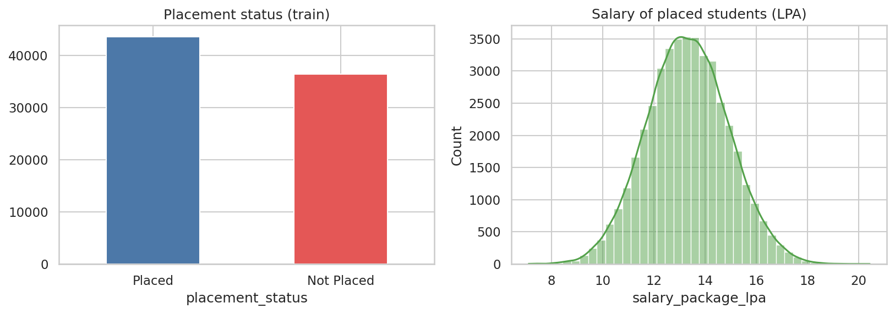

The left chart shows placement class counts on training data; the right chart shows the right-skewed salary distribution among placed students. Salary zero is not plotted as a raw value for unplaced rows.

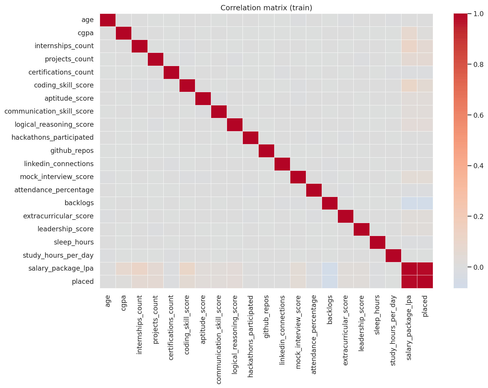

The heatmap is exploratory and includes numeric predictors and the derived `placed` target. Pairwise correlation does not capture all relationships, does not include categorical predictors, and does not imply causation.

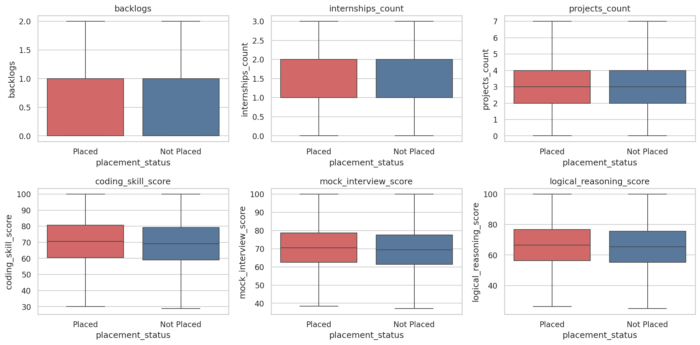

The distributions compare selected numeric predictors between placed and not-placed groups. Overlap indicates that no single feature cleanly separates the outcomes.

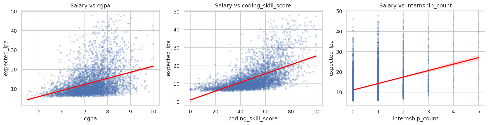

This training-data view compares salary-related feature patterns among placed records. It is descriptive, not a substitute for held-out evaluation or model importance.

### Placement model evaluation

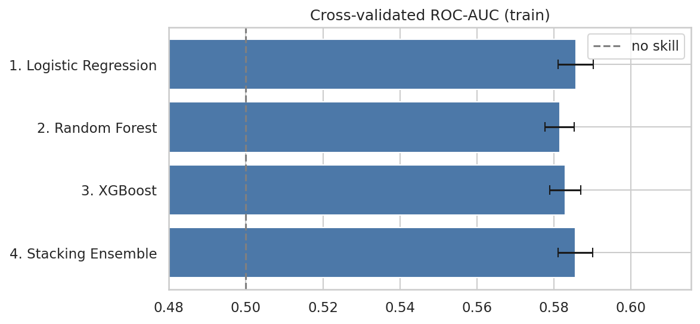

The fold means and standard deviations cluster closely across the candidate models. The highest mean belongs to stacking, but the one-standard-error rule selects Logistic Regression.

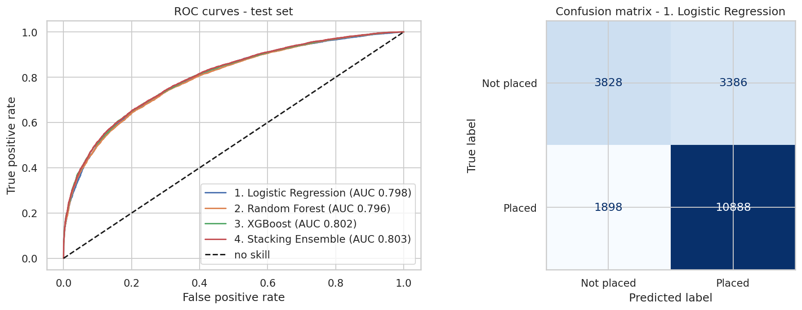

The ROC curves are similar and sit above the no-skill diagonal. At the 0.5 threshold, the selected Logistic Regression confusion matrix records 3,828 true negatives, 3,386 false positives, 1,898 false negatives, and 10,888 true positives on the 20,000-row test set.

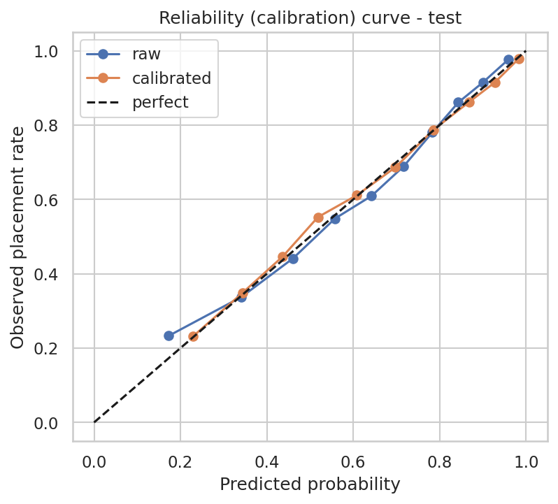

The curves compare observed frequency to predicted probability across bins. Both track the diagonal reasonably closely in this run; calibration modestly reduces the Brier score and log loss rather than making probabilities perfect.

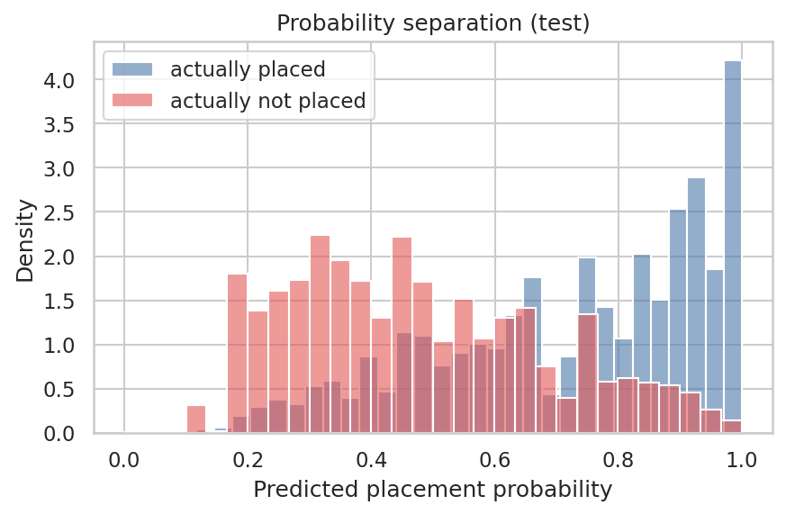

The placed and not-placed probability distributions overlap, but their centers differ. This overlap is a useful reminder that individual probabilities are uncertain even when decile-level ranking is informative.

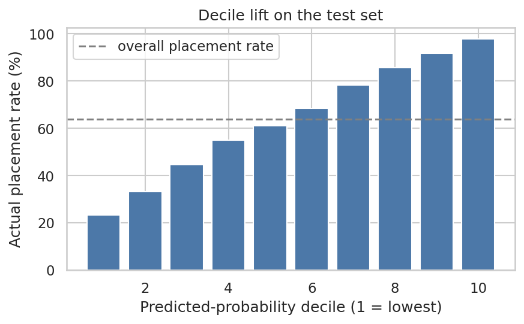

Test students are ranked by predicted placement probability and divided into ten groups. Observed placement rate rises from 23.35% in the lowest decile to 97.75% in the highest; the dashed line marks the overall test placement rate. This is ranking evidence, not proof of causal impact.

### Salary, importance, and scenarios

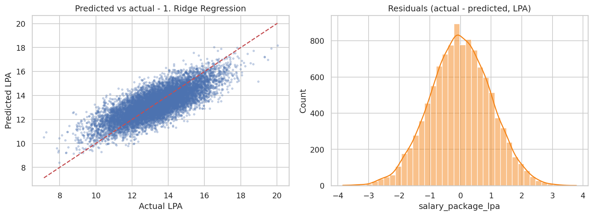

Points near the diagonal indicate accurate predictions. The scatter widens and predictions are less responsive at the upper end, while the residual histogram shows errors concentrated near zero with a tail. The figure visualizes why point metrics and an uncertainty interval both matter.

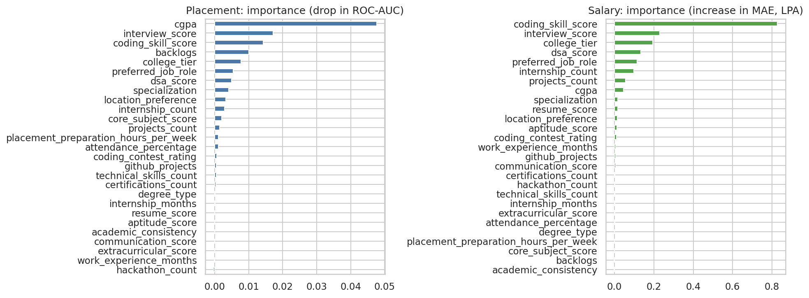

The left panel measures placement ROC-AUC drop after shuffling; the right panel measures the salary MAE increase. These importance measures are model- and sample-dependent predictive associations.

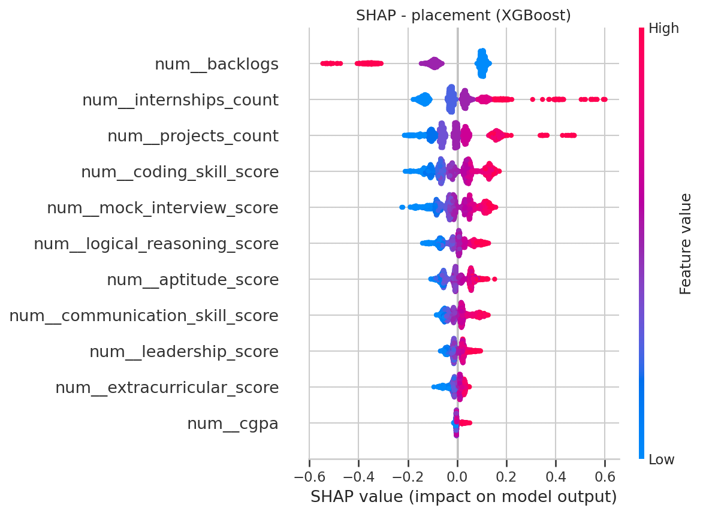

Each point shows the direction and magnitude of one feature contribution for an XGBoost placement prediction; feature values are encoded by color. This is not an explanation of the deployed Logistic Regression classifier.

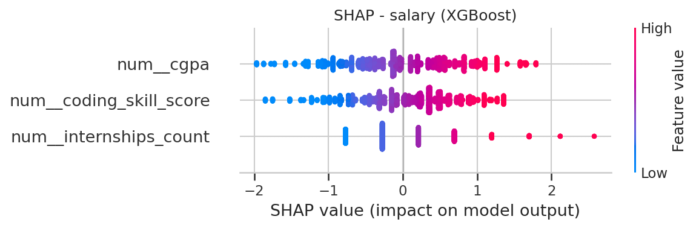

The plot shows how feature values move the XGBoost salary output relative to its baseline across the sampled test examples. Contributions are not causal effects.

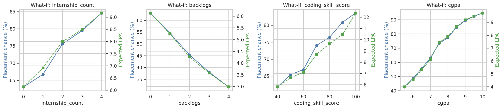

The chart varies four profile inputs around schema defaults and plots placement probability and expected LPA. It is conditional scenario analysis, not a causal estimate of changing a student's real profile.

## 23. Saved Model Artifacts

### `ML/03_models/`

| Artifact | Purpose |
|---|---|
| `placement_classifier.joblib` | Final calibrated placement-classification pipeline |
| `salary_regressor.joblib` | Selected XGBoost salary pipeline |
| `salary_q10.joblib` | LightGBM Q10 salary quantile pipeline |
| `salary_q90.joblib` | LightGBM Q90 salary quantile pipeline |
| `feature_schema.json` | Runtime contract: input feature names, classifier/regressor feature lists, types, labels, ranges or categories, defaults, currency note, and placement-probability reference quantiles |
| `model_card.json` | Row count, selected model names, calibration flag, held-out metrics, interval coverage, reliability diagnostics, random seed, and library versions |

The schema is used by the API to create `/api/schema`; the frontend uses that response to create its input controls. Keep the schema, serialized models, and `ML/05_app_ready/ml_utils.py` from the same training run together.

### `ML/04_reports/`

- `classification_cv_results.csv` and `regression_cv_results.csv`: training cross-validation comparison and fold variability.
- `classification_test_results.csv` and `regression_test_results.csv`: held-out candidate-comparison metrics.
- `feature_selection_table.csv`: p-values, mutual-information summaries, effect sizes, and keep/drop flags.
- `ablation_feature_sets.csv`: candidate-set and engineered-feature comparison.
- `metrics_summary.json`: copy of the model-card metrics for reporting.
- `figures/`: EDA, model-evaluation, uncertainty, explainability, and what-if plots referenced above.

### `ML/05_app_ready/`

- `ml_utils.py`: custom `FeatureEngineer`, `PlacementPredictor`, INR formatting, range handling, and JSON result construction.
- `requirements.txt`: pinned core libraries used to train and serialize the current artifacts, plus `joblib` and `scipy`.
- `example_input.json`: complete valid profile matching the schema.
- `README.md`: small Python example for direct predictor use.

## 24. Inference Pipeline

The Flask backend loads `PlacementPredictor` at startup. That helper loads the four joblib artifacts and schema, forms a one-row dataframe, checks that all schema input fields exist, converts and clips numeric fields to schema bounds, and calls the classifier, salary regressor, and quantile estimators. The Flask API validates requests before this helper is called; it rejects missing, invalid, non-finite, out-of-range, non-integer, or unknown categorical values with HTTP 400.

The prediction JSON includes:

```json
{
  "placement_probability": 0.6304,
  "placement_percent": 63.0,
  "predicted_placed": true,
  "profile_percentile": 47.1,
  "salary_if_placed_lpa": 9.72,
  "salary_range_lpa": [7.37, 12.77],
  "salary_if_placed_inr": 972088,
  "salary_range_inr": [737092, 1277192],
  "salary_if_placed_text": "Rs 9,72,088 per year",
  "expected_lpa": 6.13,
  "expected_inr": 612829
}
```

Values above are illustrative response values, not fixed outputs. The API's actual endpoints in `backend/app.py` are:

| Method and route | Behavior |
|---|---|
| `GET /api/schema` | Returns `fields`, each with name, label, type, and numeric range or categorical options. |
| `GET /api/model-info` | Returns `training_rows` and `reliability_note`. |
| `POST /api/predict` | Validates the profile and returns predictor output, or HTTP 400 with a field-keyed `errors` object. |

`1 LPA = Rs 1,00,000 per year`. `profile_percentile` is derived by interpolating the placement probability against the saved reference quantiles in `feature_schema.json`; it is a relative rank within the training reference, not a population percentile claim.

## 25. Frontend and Backend Integration

### Backend

`backend/app.py` is a small Flask service listening on `127.0.0.1:8000`. It loads model artifacts once, adds `ML/05_app_ready/` to the Python module path so joblib can resolve `FeatureEngineer`, builds the schema response, and independently validates submitted values.

### Frontend

The application under `frontend/` uses React 18 and Vite. It provides:

- Navigation and sections for Home, Predictor, Methodology, Models/Results, Dataset, and the GitHub repository.
- A 27-field form grouped by profile area, generated from `/api/schema`.
- Required-field, numeric-range, integer, and category validation in the browser, with server-side validation retained as authoritative.
- Loading, error, and successful prediction states.
- Placement probability and status, salary-if-placed, salary range, profile percentile, expected LPA, and the model reliability note.
- A responsive layout, mobile navigation, and a not-found view.

The hero's 82.4% probability, ₹8.4 LPA salary, and range are static illustrative display values. They are not fetched predictions; predictions are shown in the result panel after form submission. The app's “Expected Salary” card displays the backend's `salary_if_placed_lpa` value, with expected LPA shown separately beneath the result cards.

`frontend/vite.config.js` serves the development app on port 5173 and proxies `/api` to `http://127.0.0.1:8000`. `frontend/src/api.js` also supports an optional `VITE_API_BASE_URL` for a separately hosted API.

## 26. Reproducibility

### Run the application locally

Use two PowerShell terminals from the repository root.

**Terminal 1: backend**

```powershell
cd backend
py -3.12 -m venv .venv
.\.venv\Scripts\Activate.ps1
python -m pip install -r requirements.txt
python app.py
```

If the compatible local environment already exists, it can be activated instead:

```powershell
cd backend
.\.venv312\Scripts\Activate.ps1
python app.py
```

The API listens on `http://127.0.0.1:8000`. Python 3.12 and the exact package versions in `ML/05_app_ready/requirements.txt` are recommended for the checked-in joblib models; version mismatches have caused XGBoost deserialization failures.

**Terminal 2: frontend**

```powershell
cd frontend
npm install
npm run dev
```

Open `http://localhost:5173`. To run a production build, use `npm run build` from `frontend/`.

### Run the notebook

1. Ensure `ML/01_data/placement_dataset_100k.csv` is present. The notebook also searches supported Kaggle input paths and copies the selected CSV into `ML/01_data/`.
2. Create a Python 3.12 environment and install `ML/05_app_ready/requirements.txt` plus notebook-only packages used in the notebook, including Jupyter, matplotlib, seaborn, and SHAP. SHAP plotting is conditional in the notebook if SHAP is unavailable.
3. Open `ML/02_notebook/ai-project04.ipynb` and run the cells in order. The full configuration uses seed 42, an 80/20 test split, five-fold model evaluation, a 30,000-row tuning sample, and ten randomized-search iterations.
4. Review regenerated model, schema, metric, and figure artifacts together before restarting the API.

Setting `QUICK_MODE=1` reduces the notebook to a 20,000-row sample, three main CV folds, an 8,000-row tuning sample, and three randomized-search iterations. This is a smoke-test configuration, not the run behind the reported full-dataset metrics.

**Notebook side effect:** the current artifact-generation cell writes a short README to the repository root. Running that cell overwrites this evaluator-focused README. Preserve or restore this documentation after retraining; a future notebook change should stop generating the root README or write only to a separate generated-notes file.

### Direct predictor smoke test

From the repository root, with compatible dependencies installed:

```powershell
python -c "import json, sys; sys.path.insert(0, 'ML/05_app_ready'); from ml_utils import PlacementPredictor; p = PlacementPredictor('ML/03_models'); print(json.dumps(p.predict(json.load(open('ML/05_app_ready/example_input.json'))), indent=2))"
```

The sample payload is also suitable for a `POST /api/predict` request. For repeatability, keep generated artifacts from one notebook run together and record the dependency versions alongside any regenerated metrics.

## 27. Limitations

- **Dataset representativeness:** model performance on this dataset does not establish performance on a real campus, institution, hiring cohort, or future period. The current dataset is the only evaluated population here.
- **Placement uncertainty:** the model-card reliability note explicitly says to treat placement probabilities as a rough guide. AUC, calibration, probability distributions, and decile outcomes describe aggregate test behavior, not certainty about an individual.
- **Salary error:** the selected salary model has 2.61 LPA test MAE and 3.83 LPA RMSE; the mean 80% interval is wide at 8.12 LPA.
- **Conditional salary:** the salary regressor estimates salary for placed students. It does not directly predict whether a student will get an offer.
- **Missing confounders:** employer, role-specific hiring, geography, institution-specific recruiting, market conditions, interview-day performance, and other variables may be absent or coarsely represented.
- **Association is not causation:** a predictive feature association does not show that changing the feature would cause placement or salary to change.
- **Protected attributes and proxies:** age is excluded, but excluding one attribute does not prove fairness or eliminate correlated proxies.
- **No deployment-grade governance:** the repository does not establish ongoing drift monitoring, external validation, subgroup approval, audit procedures, or a production decision process.
- **Serialized-model compatibility:** joblib artifacts depend on compatible Python and ML-library versions.

## 28. Future Work

These are possible next steps, not completed project capabilities:

- Validate on independently collected, documented, and representative placement data, ideally with time-based and institution-based holdouts.
- Measure calibration and errors across relevant subgroups, assess fairness and proxy effects, and document data consent and provenance.
- Compare interval methods and report interval width/coverage by salary range and student subgroup, not only aggregate coverage.
- Add temporal drift and input-range monitoring before any production deployment.
- Add automated tests for schema/model compatibility, API validation, serialized-artifact loading, and frontend-to-backend prediction behavior.
- Move model metrics and schema summaries into a generated documentation step that does not overwrite the hand-written root README.
- Deploy behind a production WSGI server with environment-based configuration, logging, monitoring, and appropriate privacy controls if there is a justified deployment use case.

## 29. Project Structure

```text
placement_project/
├── README.md
├── HOW_TO_RUN.md
├── backend/
│   ├── app.py
│   └── requirements.txt
├── frontend/
│   ├── index.html
│   ├── package.json
│   ├── vite.config.js
│   ├── public/
│   └── src/
│       ├── App.jsx
│       ├── Form.jsx
│       ├── Result.jsx
│       ├── api.js
│       ├── format.js
│       ├── NotFound.jsx
│       └── styles.css
└── ML/
    ├── 01_data/
    │   └── placement_dataset_100k.csv
    ├── 02_notebook/
    │   └── ai-project04.ipynb
    ├── 03_models/
    │   ├── feature_schema.json
    │   ├── model_card.json
    │   ├── placement_classifier.joblib
    │   ├── salary_q10.joblib
    │   ├── salary_q90.joblib
    │   └── salary_regressor.joblib
    ├── 04_reports/
    │   ├── ablation_feature_sets.csv
    │   ├── classification_cv_results.csv
    │   ├── classification_test_results.csv
    │   ├── feature_selection_table.csv
    │   ├── metrics_summary.json
    │   ├── regression_cv_results.csv
    │   ├── regression_test_results.csv
    │   └── figures/
    └── 05_app_ready/
        ├── example_input.json
        ├── ml_utils.py
        ├── README.md
        └── requirements.txt
```

## 30. Conclusion

The current implementation is a reproducible tabular supervised-learning experiment connected to a working local prediction app. It compares multiple candidate models, chooses the deployed models using training cross-validation, calibrates placement probabilities conditionally, estimates a salary interval, and exposes the generated schema and predictions through a Flask API. Its reported metrics should be read with the dataset scope, uncertainty, and limitations above.

## 31. References

- [Project repository](https://github.com/kishlay-bit/PlacementPredictor)
- [Student Placement Prediction Dataset on Kaggle](https://www.kaggle.com/datasets/kishlaytejeswi/student-placement-prediction-dataset)
- [scikit-learn documentation](https://scikit-learn.org/stable/)
- [XGBoost documentation](https://xgboost.readthedocs.io/)
- [LightGBM documentation](https://lightgbm.readthedocs.io/)
- Current project-specific methodology and results: [`ML/02_notebook/ai-project04.ipynb`](ML/02_notebook/ai-project04.ipynb), [`ML/03_models/model_card.json`](ML/03_models/model_card.json), [`ML/03_models/feature_schema.json`](ML/03_models/feature_schema.json), and [`ML/04_reports/`](ML/04_reports/).
